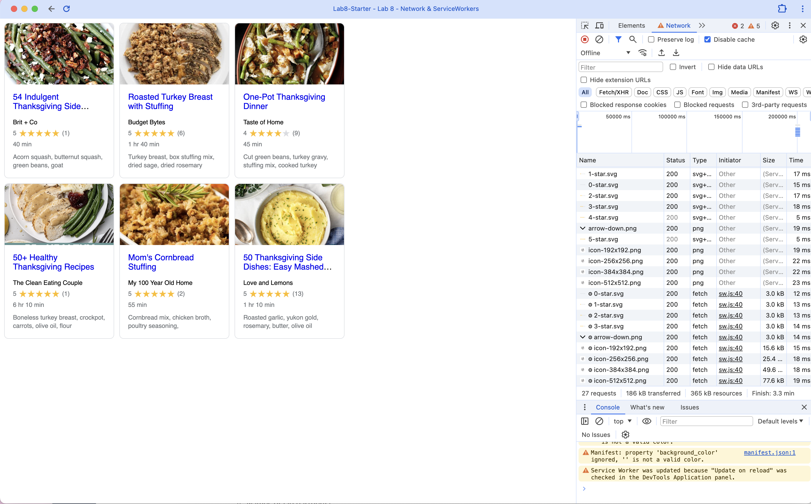

# Lab8-Starter

### Graceful Degradation and Service Workers

Graceful degradation and service workers are related in the sense that both approaches aim to improve the user experience under less-than-ideal conditions. Graceful degradation involves designing applications to function under maximum capabilities but ensuring they degrade gracefully when advanced features are not available. Similarly, service workers enhance applications by allowing them to handle network disruptions gracefully. They enable offline functionality and improve performance by caching resources, ensuring that even if the network is slow or unavailable, the application can still provide a reasonable user experience. Both concepts prioritize user experience by maintaining functionality despite adverse conditions.

